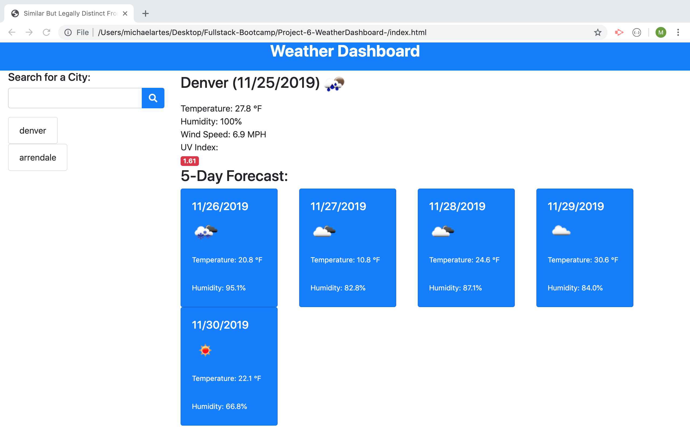

# Project-6-WeatherDashboard-
This project is a weather dashboard application that allows users to enter a city and recieve current weather conditions as well as a 5 day forecast. The weather data comes from the openweather API. 
# Project Goal
The goal of this project is to help student developers in the JHU Fullstack Bootcamp gain skills making AJAX calls to APIs and creating web applications with dynamically updated html powered by JS and JQuery.

# link
<a href="https://michaelartes89.github.io/Project-6-WeatherDashboard-/"> Click Here For Link to Project </a>

# screenshot

# Developer Story
-JavaScript Journey
My personal goal for this project was to apply what I learned on the previous weeks project and continue to build my JS skills. Having not worked with JS prior to the initial class lesson a few weeks ago, its has been somewhat of an uphill battle. After also enduring a serious of nightmarish events in outside the classroom, I am doing my best to maintain my fighting spirit. With that said , I had some defintive positive takeaways from this project. 
-Getting Started 
I started out strong by setting up an intial html framework based on a bootstrap grid layout and planning to utilize dynamically generated element through jquery. I researched different ways to take the text that a user enters into an html input element and store it as a variable with jquery. This is a very useful fundamental for many projects. I also set up AJAX calls to the openweather API and logged the response to the console in order to see how I could use the data to achieve the result of the project goals. I was able to get the seperate calls for the forecast and uv index data back succesfully. These steps are documented in my script.js file. 
-Trouble Ahead 
After starting out strong, I had a setback with figuring out exactly how to get the weather icons, and then realizing I realy was not sure about how to write the JS functions that would be needed to build the functionilty. By this point many other student form the class had posted thier solutions on github so I searched through the solutions for help. As I have written before having access to this local network of student developers is a huge advantage compared to someone who is on thier own as a self taught developer. I checked out Colin's solutions, since he typically does a great job writting comment that make his code easy to read. Sure enough, Colin had a solution to get the weather icons and had written in his README about how this project helped him get to a better understanding of writing functions and linking them together to form a working application. I set out to follow Colin's example and I wrote out functions that matched the ones hes created for his project. Since I still really new to JS just writing code, especially from working examples, is a step in the right direction for me. After finishing writing all the same functions as Colin, I tested my code and I had an error that was preventing anything from working. Bummer. 
-Plan B
I worked through some troubleshoot steps but since I did not completely understand the functions Colin wrote anyway, I went back GITHUB to see if anyone else had posted a potentially more simplified solution that I could follow. Eurecka! fellow classmate Phil had posted a project called Might be Cold as pmitch242 which had really amazing comments with a just about a step by step build up for this project. Lots of thanks to Phil for posting really oustanding intructional material. I re-wrote the solution that Phil had posted pretty much exactly,I added my own humorous reference into the title and put in some custom css. There are still a few parts that I did not understand 100 percent. I have already reached out to trilogy to get extra tutoring help starting next week and I am looking forward to having time to regroup during the thanksgiving break this week. I am including Phil's copywrite info from the readme, not sure if this is required by just to be on the safe side, MIT License

Copyright (c) 2019 pmitch242

Permission is hereby granted, free of charge, to any person obtaining a copy of this software and associated documentation files (the "Software"), to deal in the Software without restriction, including without limitation the rights to use, copy, modify, merge, publish, distribute, sublicense, and/or sell copies of the Software, and to permit persons to whom the Software is furnished to do so, subject to the following conditions:

The above copyright notice and this permission notice shall be included in all copies or substantial portions of the Software.

THE SOFTWARE IS PROVIDED "AS IS", WITHOUT WARRANTY OF ANY KIND, EXPRESS OR IMPLIED, INCLUDING BUT NOT LIMITED TO THE WARRANTIES OF MERCHANTABILITY, FITNESS FOR A PARTICULAR PURPOSE AND NONINFRINGEMENT. IN NO EVENT SHALL THE AUTHORS OR COPYRIGHT HOLDERS BE LIABLE FOR ANY CLAIM, DAMAGES OR OTHER LIABILITY, WHETHER IN AN ACTION OF CONTRACT, TORT OR OTHERWISE, ARISING FROM, OUT OF OR IN CONNECTION WITH THE SOFTWARE OR THE USE OR OTHER DEALINGS IN THE SOFTWARE.

-Final Thoughts
At this point I am doing my best to get as much out of this bootcamp experience as possible and I am thankful to have connections to outstanding resoures including the soon-to-be pro developers in our class. Many people who go on the journey give up when they feel like they will never get it but one lesson I have learned many times in life is to never say never. 

